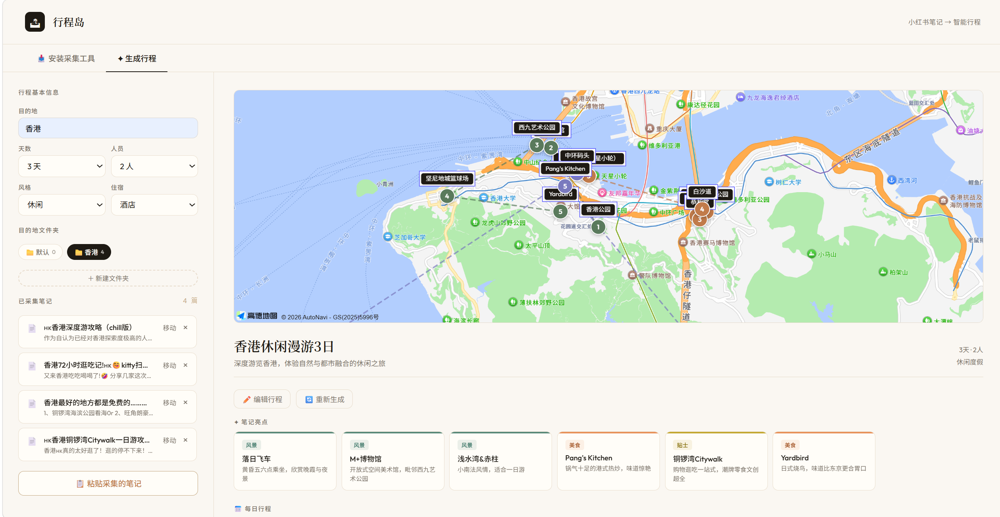
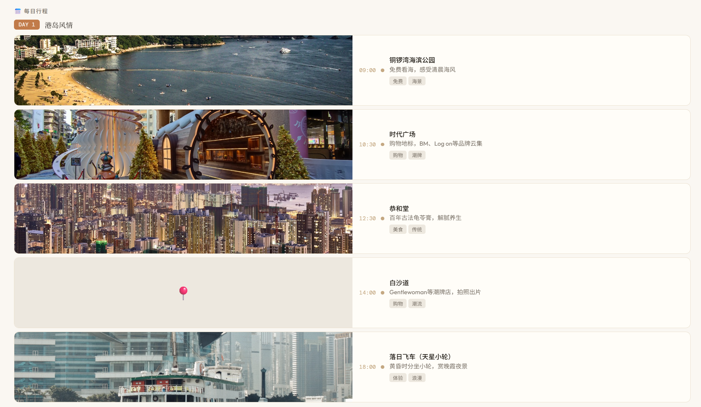

# 行程岛 · 基于小红书笔记的智能旅行助手

> 把你收藏的小红书旅行笔记，一键变成精美行程规划

## 项目简介

传统旅行规划工具（携程、高德）提供的是标准化 POI 数据，缺乏真实用户的口碑和温度。**行程岛**从小红书笔记出发，利用 AI 提炼真实用户的旅行经验，生成个性化行程，同时配合地图可视化和景点图片，让规划过程更直观、更有种草感。

## 核心功能

- **Bookmarklet 一键采集**：在浏览器书签栏安装采集工具，打开小红书笔记点一下即可采集，无需复制粘贴
- **文件夹分组管理**：按目的地创建文件夹，笔记分类归档，互不干扰
- **AI 智能规划**：多篇笔记聚合输入，DeepSeek 提炼每日行程、种草亮点、避雷提醒
- **地图可视化**：高德地图展示景点分布，按天分色 + 虚线连线，路线一目了然
- **景点图片**：Unsplash 自动搜索景点配图，中英文城市名自动翻译
- **行程可编辑**：支持文字修改、拖拽排序、增删景点，编辑后地图自动同步

## 技术架构

```
前端                    后端
index.html             FastAPI (Python)
├── Bookmarklet        ├── /api/generate    → DeepSeek API
├── 文件夹管理          ├── /api/geocode     → 高德地图 Web 服务
├── 行程生成            ├── /api/images/batch → Unsplash API
└── 高德地图 JS API     └── /api/translate-city
```

## 快速开始

### 环境要求

- Python 3.11+
- Conda（推荐）或 pip

### 安装依赖

```bash
cd backend
pip install -r requirements.txt
```

### 配置 API Key

复制 `.env.example` 为 `.env`，填入以下 Key：

```env
# 必填
DEEPSEEK_API_KEY=your_deepseek_key

# 选填（不填则地图/图片功能不可用）
AMAP_API_KEY=your_amap_web_service_key
UNSPLASH_ACCESS_KEY=your_unsplash_access_key
```

| Key | 获取地址 | 是否必填 |
|-----|---------|---------|
| DeepSeek API Key | https://platform.deepseek.com | ✅ 必填 |
| 高德地图 Web 服务 Key | https://console.amap.com | 选填 |
| 高德地图 JS API Key | https://console.amap.com | 选填（地图显示用）|
| Unsplash Access Key | https://unsplash.com/developers | 选填 |

### 启动后端

```bash
cd backend
uvicorn main:app --host 127.0.0.1 --port 8000
```

### 打开前端

用 VS Code Live Server 或任意 HTTP 服务打开 `index.html`，访问 `http://127.0.0.1:5500`。

> ⚠️ 直接双击打开 `file://` 协议会导致 Bookmarklet 跨域失败，请务必通过 HTTP 服务访问。

## 使用流程

1. **安装采集工具**：打开「安装采集工具」标签页，将「🏝 采集到行程岛」按钮拖到浏览器书签栏
2. **采集笔记**：打开任意小红书旅行笔记，点击书签栏按钮，选择目的地文件夹
3. **生成行程**：切换到「生成行程」标签页，选择文件夹，填写天数、人员、风格，点击生成
4. **编辑行程**：点击「✏️ 编辑行程」，可修改文字、拖拽排序、增删景点
5. **查看地图**：行程生成后顶部自动显示景点分布地图，按天分色连线

## 项目截图




## 目录结构

```
├── index.html          # 前端主页面（含全部 JS/CSS）
├── README.md
└── backend/
    ├── main.py         # FastAPI 后端
    ├── requirements.txt
    ├── .env.example    # 环境变量模板
    └── .gitignore
```

## 后续规划

- [ ] 升级为 Chrome/Edge 浏览器插件，提升采集体验
- [ ] 接入 Pexels 作为图片备用源
- [ ] 行程导出为 PDF / 分享图片
- [ ] 上线部署，支持多用户使用

## 致谢

本项目基于 [Hello-Agents](https://github.com/datawhalechina/hello-agents) 课程完成，参考了课程提供的 trip-planner 示例项目架构。
